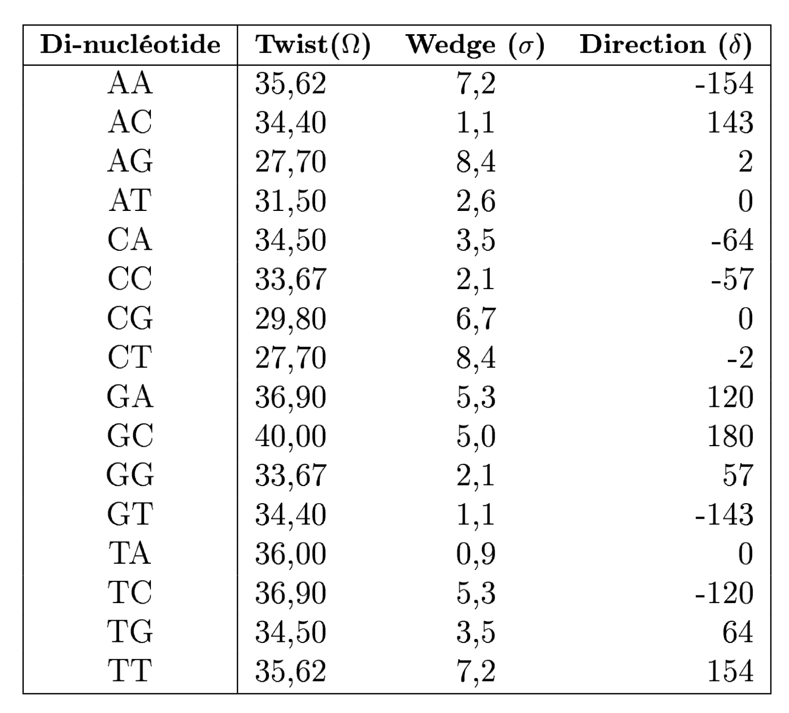
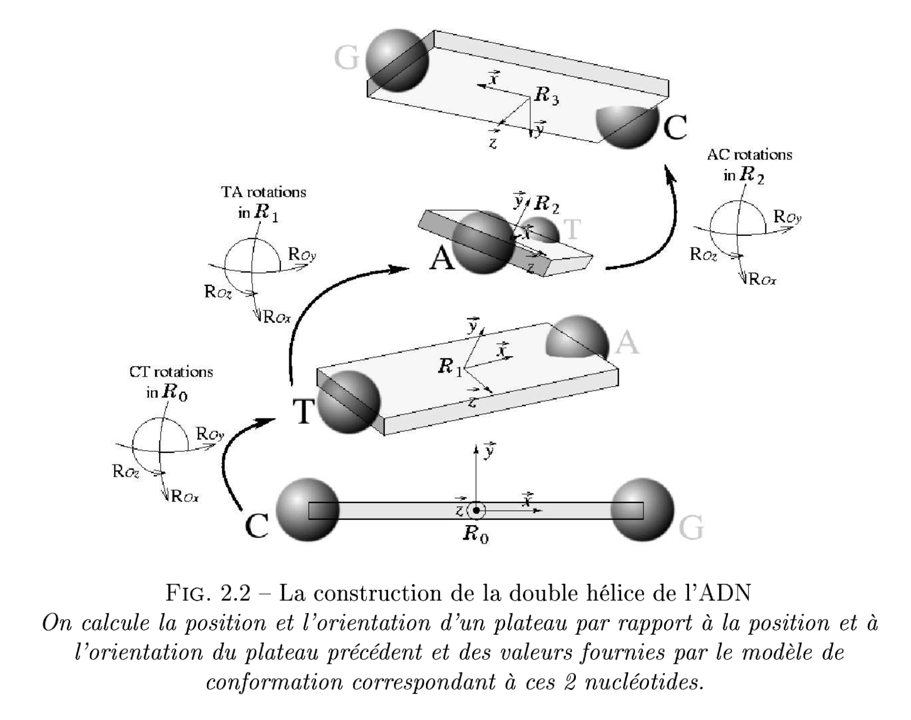

# ST2 (Théorie des Jeux) - EI Algorithmique Génétique

## Contexte
Toutes les cellules qui constituent la vie sur Terre comportent en elles une ou plusieurs molécules d'ADN qui sont le support de l'information génétique. Ces molécules, plus ou moins longues, sont composées d'une succession de nucléotides (ou bases : A, C, G et T) qui interagissent avec de nombreux éléments cellulaires et dont le positionnement dans l'espace joue un rôle important dans l'adaptation de la cellule à son environnement (chaleur, famine, stress...). Si les séquences d'ADN sont aujourd'hui très largement étudiées à travers leur séquence textuelle (succession de A, C, G et T), il est très instructif de les étudier à partir de leur trajectoire tri-dimensionnelle. En 1993, des biopysiciens ont établi un modèle de conformation 3D qui permet de transformer une suite de nucléotides (sous forme de lettres) en une trajectoire tri-dimensionnelle. Dès lors, il est possible de représenter toute séquence textuelle d'ADN en une trajectoire 3D.

## Problématique
Ce modèle ayant été développé pour de courtes séquences d'ADN nu, il ne prend pas en compte toutes les caractéristiques d'une longue chaîne au sein de la cellule (surenroulements, nucléosomes, interactions longue distance...). Par exemple, si on observe un chromosome bactérien (longue séquence d'ADN constituant une bactérie) ou un plasmide (petite séquence présente au sein des bactéries), on s'aperçoit que ce chromosome ou ce plasmide est circulaire, i.e. les deux extrémités ont été "collées" l'une à l'autre. Le modèle pré-cité ne rend pas compte de ce phénomène lorsque l'on représente la trajectoire 3D d'un chromosome bactérien ou d'un plasmide.

## Énoncé
L'objectif de ce projet est de modifier le modèle de conformation 3D donné afin de rendre un plasmide circulaire. Pour cela, deux algorithmes seront développés : un algorithme génétique et un algorithme de type Monte-Carlo Tree Search. Ces algorithmes seront implantés en Python et structurés en classes (programmation orientée objet).

## Ressources

Sont fournis :

- le fichier <tt>Traj3D.py</tt> implémentant le moteur de calcul d'une trajectoire 3D,
- le fichier <tt>Rot_Table.py</tt> contenant la table de rotations nécessaires au calcul d'une trajectoire 3D (ce fichier devra être modifié),
- le fichier <tt>Main.py</tt> illustrant un exemple d'utilisation de la classe Traj3D,
- deux fichiers <tt>.fasta</tt> contenant les séquences de deux plasmides de longueur différente (8 000 dans un cas et 180 000 dans l'autre).

Objectifs :

Il faut réussir, pour une chaîne quelconque de nucléotide, à faire évoluer les angles de la matrice de rotation à l’intérieur de leur intervalle d’incertitude (renseigné sur les 3 dernières colonnes) de sorte à ce que la chaîne face un rond. 

Il faut d’abord créer une fonction heuristique qui va évaluer si la représentation 3D d’une chaîne en fonction d’une certaine table de rotation est bonne, soit :
    Si les 2 bouts en extrémité de chaîne coincident 
    Si la chaine globale à une forme circulaire (avoir le moins de deviation brutale)

A partir de cette fonction d'évaluation d'une trajectoire 3d, on va :

- Créer l'algorithme de Monte Carlo : A partir de la racine qui correspond à la config initiale et qui a au début une valeur 0/0 (0 simulation réussie/0 simulations faites) de RotTable, on va créer une branche qui correspond à une nouvelle config, 
        
- Créer l'algo génétique : On va générer une population initiale de matrice avec une certaine distrib puis on va les faire combattre en 1vs1. On garde ensuite les gagnants avec une certaine proba de prendre un perdant (pour avoir un max de diversité) mais il faut s'assurer de garder le meilleur si il se fait recaler injustement : c'est la SELECTION. Ensuite on va faire se croiser les gagnants 2 à 2 en ... : c'est le CROISEMENT. Puis vient la MUTATION.
